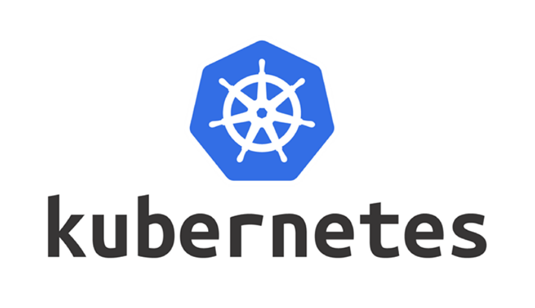

# Dell-Resilient-Kubernetes-Cluster-Availability

<h2> What our project is all about </h2>

In this project we design a protocol to provide data resiliency for Kubernetes. 


<p align="center">
   
</p>

<p align="center">
  
</p>

This protocol works by migrating failed etcd pods. To do this we communicate with the etcd and Kubernetes API's to get information about the Kubernetes cluster and the etcd cluster. This information is then used to decide which pods are to be migrated and and where they will be migrated to. 

<h2> How to use our project </h2>
First you would need to make sure that you are running a multinode vanilla cluster (meaning no minikube), which can be setup on a single computer using virtual machines if you follow this video: <br> [Create a Multi-Node Kubernetes Cluster with VMs]([url](https://www.youtube.com/watch?v=s3EdEILiLdI)). </br> You would need at least 1 master and 4 worker nodes. 

<br> </br>

Then you would want to run etcd as an external service. To do this you would first need to make sure that all worker nodes that may have an etcd pod has a data directory to mount the pod onto. To make this directory, run the following commands on each worker node:

```
   > sudo su
   > {ENTER PASSWORD}
   > cd /root
   > mkdir data
   > mkdir data/myss
   > ls /data/myss
```
<br> </br>

Once you have the data directory, you can apply the persistent volume files that will be used to bind the pod to a particular worker nodes data directory by doing

```
   kubectl apply -f {YAML FILE}
```

With the following files: pv1.yaml, pv2.yaml, pv3.yaml

<br> </br>

After you have that set up, you could deploy our protocol by running the following script:

```
   python3 resilient.py
```
